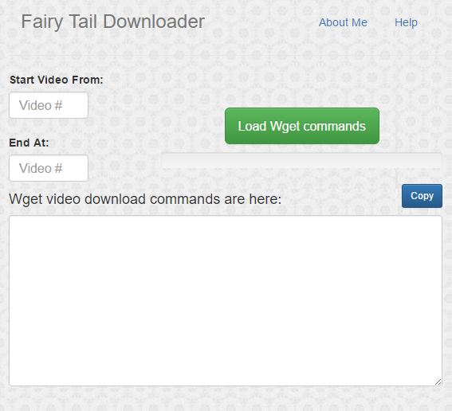
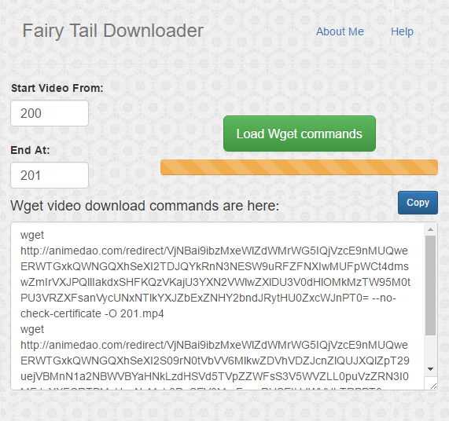
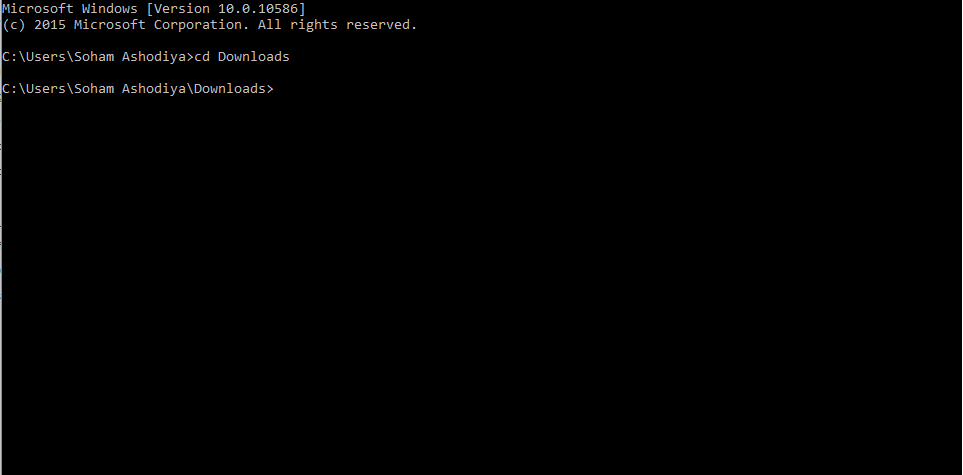
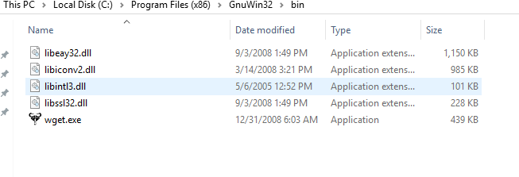
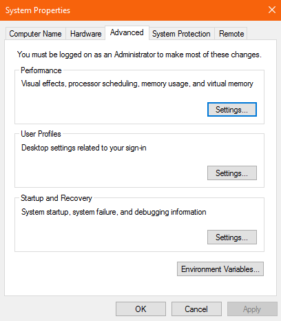
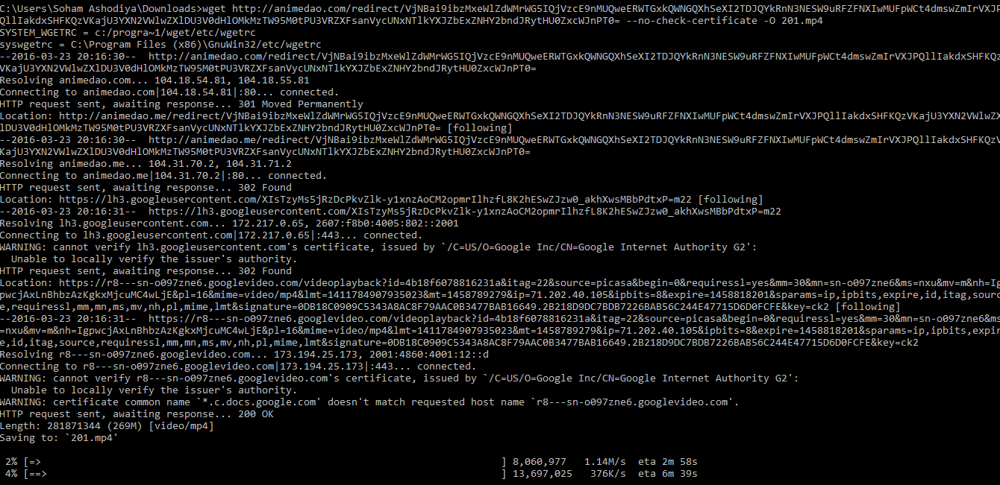

#Fairy Tail Video Downloader

This application lets you download most subbed episodes of Fairy Tail in 720p. If not, 360p.

##Installation:
- Download this ZIP file. (Download Button is located on the top right of this page)
- Extract the folder from the ZIP file.
- In Google Chrome, go to <a href="chrome://extensions/">Extensions</a>
- Enable Developer Mode. (Checkbox is located on top right of the Extensions page)
- Click Load unpacked extension and navigate to the folder that you extracted.
- Now, you should see the app installed <a href="chrome://apps/">here</a>.
- Before you can actually use the application, you need to download Wget.
- Download Wget from <a href="https://www.gnu.org/software/wget/">here</a>.
- Go back to Apps and click on the app to run it!

##What do I do with the commands that have appeared in the text box?
- Open your Command Prompt.
- Cd to the directory you want the installation to occur. (Type in cd directory path)
- Copy the commands into the Command Prompt and hit Enter.
- Wait until the Command Prompt finishes downloading the videos.
- Enjoy your episodes!

##Screenshots:

###Homepage

###Inputted Start and End values

###After installing Wget, the user will cd to the destination folder

###To start using Wget, you will need to add it to your environment variables. Navigate to Wget's installation folder.

###Copy the path (Alt+D) of the folder, and add it to the PATH in the environment variables.

###Copy and paste the commands generated by the Fairy Tail Downloader and paste them in the Command Line.

##Technologies Used:
- Bootstrap
- Toastr
- Chrome Extension Kit
- jQuery
